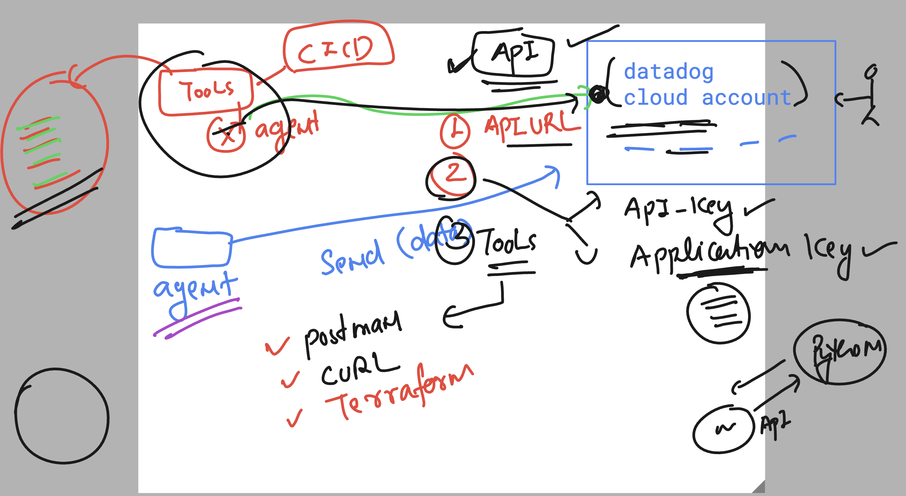
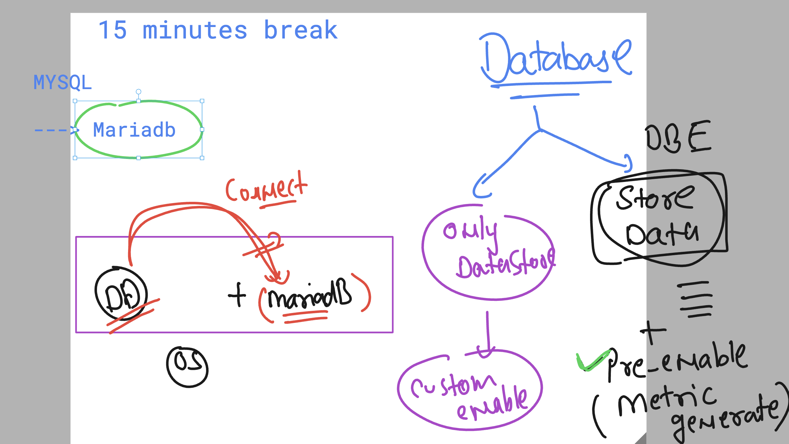

### Datadog API connect



### creating dashboard from api 

```
curl -X POST "https://api.datadoghq.com/api/v1/dashboard" \
-H "Content-Type: application/json" \
-H "DD-API-KEY: " \
-H "DD-APPLICATION-KEY: " \
-d '{
  "title": "Ashutoshh Trainer 3 Overall CPU Usage Dashboard",
  "description": "Dashboard showing CPU usage across all Datadog agent hosts",
  "widgets": [
    {
      "definition": {
        "type": "timeseries",
        "requests": [
          {
            "q": "avg:system.cpu.user{*}",
            "display_type": "line",
            "style": {
              "palette": "dog_classic",
              "line_type": "solid",
              "line_width": "normal"
            }
          }
        ],
        "title": "Average CPU Usage (User Time)"
      }
    }
  ],
  "layout_type": "ordered"
}'

```

### listing dashboard 

```
 curl -X GET "https://api.datadoghq.com/api/v1/dashboard" \ 
 -H "Content-Type: application/json" \
 -H "DD-API-KEY: " \
 -H "DD-APPLICATION-KEY: "
```

## Database Monitoring 

### installing Mariadb-server

```
yum install mariadb105-server -y

===> starting database service 
 
systemctl enable --now mariadb

===> setting admin password of DB 

mysql_secure_installation  

```

### datadog and mysql db connection 



### Login to database check few details 

```
 mysql -u root -p
Enter password: 
Welcome to the MariaDB monitor.  Commands end with ; or \g.
Your MariaDB connection id is 14
Server version: 10.5.25-MariaDB MariaDB Server

Copyright (c) 2000, 2018, Oracle, MariaDB Corporation Ab and others.

Type 'help;' or '\h' for help. Type '\c' to clear the current input statement.

MariaDB [(none)]> 

show databases;
+--------------------+
| Database           |
+--------------------+
| information_schema |
| mysql              |
| performance_schema |
+--------------------+
3 rows in set (0.000 sec)

===> Create One account in Database to all access 

CREATE USER 'datadog_user'@'localhost' IDENTIFIED BY 'datadog_password';

===> Granting Permissions

GRANT REPLICATION CLIENT, PROCESS ON *.* TO 'datadog_user'@'localhost';

===> Reload tables permission 

FLUSH privileges;

```
### verify datadog_user permission 

```
mysql -u datadog_user -pdatadog_password 
Welcome to the MariaDB monitor.  Commands end with ; or \g.
Your MariaDB connection id is 15
Server version: 10.5.25-MariaDB MariaDB Server

Copyright (c) 2000, 2018, Oracle, MariaDB Corporation Ab and others.

Type 'help;' or '\h' for help. Type '\c' to clear the current input statement.

MariaDB [(none)]> show databases;
+--------------------+
| Database           |
+--------------------+
| information_schema |
+--------------------+
1 row in set (0.000 sec)

MariaDB [(none)]> exit;
Bye

```
### checking show status 

```
mysql -u datadog_user -pdatadog_password   -e "show status" 

```

### do datadog conf integration 

```

cd /etc/datadog-agent/conf.d/mysql.d/
nano ashudb.yaml 

init_config:

instances:
  - host: 127.0.0.1
    username: 'datadog_user'
    password: 'datadog_password'
    port: 3306
    options:
      replication: false
      galera_cluster: true
      extra_status_metrics: true
      extra_innodb_metrics: true
      schema_size_metrics: false
      disable_innodb_metrics: false
```

