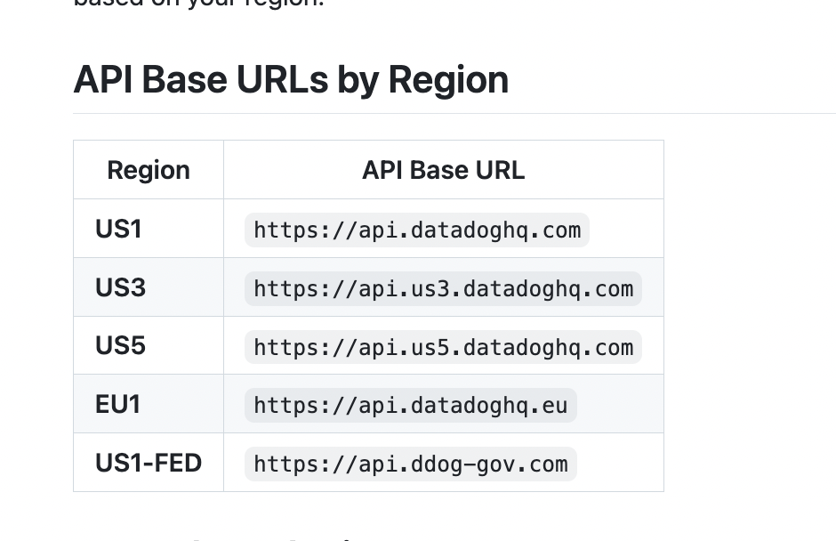

## Datadog 


### api URL based on Region of cloud DC 



### Now we have to ask developers to write code to generate custom metrics 


### Generating custom metrics rules 


### check port number details 

```
netstat -nulp
Active Internet connections (only servers)
Proto Recv-Q Send-Q Local Address           Foreign Address         State       PID/Program name    
udp        0      0 127.0.0.1:8125          0.0.0.0:*                           2068/agent          
udp        0      0 172.31.36.157:68        0.0.0.0:*                           2061/systemd-networ 
udp        0      0 127.0.0.1:323           0.0.0.0:*                           2554/chronyd        
udp6       0      0 ::1:323                 :::*                                2554/chronyd        
udp6       0      0 fe80::a6:49ff:feec::546 :::*                                2061/systemd-networ 
[root@ip-172-31-36-157 ~]# 

```

### creating directory and python app

```
[root@ip-172-31-36-157 ~]# cd /opt/
[root@ip-172-31-36-157 opt]# ls
ashu-python-webapp  aws  containerd  datadog-agent  python-flask-weathermap  resources
[root@ip-172-31-36-157 opt]# 
[root@ip-172-31-36-157 opt]# 
[root@ip-172-31-36-157 opt]# mkdir final_pythonapp
[root@ip-172-31-36-157 opt]# cd final_pythonapp/
[root@ip-172-31-36-157 final_pythonapp]# 

```

### understanding business need 


### Installing datadog lib in python 

```
pip install --upgrade datadog 

```
